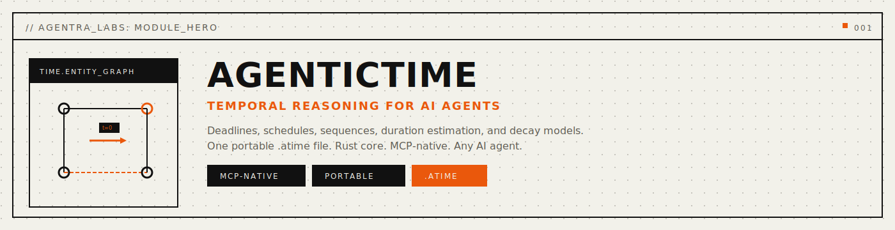
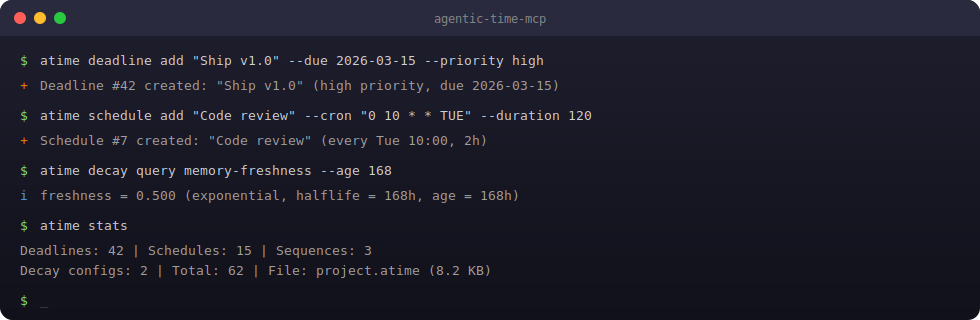
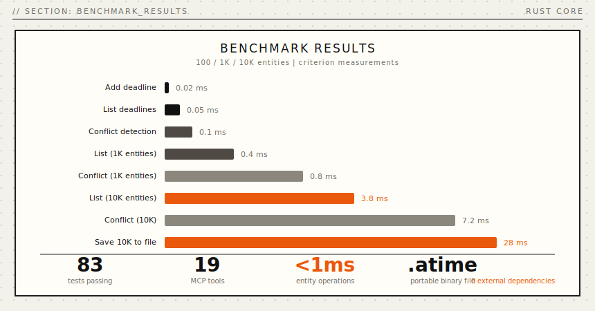
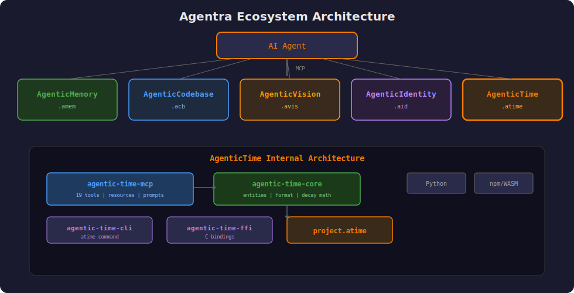

<p align="center">
  
</p>

<p align="center">
  <a href="https://crates.io/crates/agentic-time"></a>
  
  
</p>

<p align="center">
  <a href="#install"></a>
  <a href="#install"></a>
  <a href="#mcp-server"></a>
  <a href="LICENSE"></a>
  <a href="docs/api-reference.md"></a>
</p>

<p align="center">
  <strong>Temporal reasoning for AI agents.</strong>
</p>

<p align="center">
  <em>Deadlines, schedules, sequences, durations, and decay. One file. Any model.</em>
</p>

<p align="center">
  <a href="#problems-solved">Problems Solved</a> · <a href="#quickstart">Quickstart</a> · <a href="#how-it-works">How It Works</a> · <a href="#mcp-tools">MCP Tools</a> · <a href="#benchmarks">Benchmarks</a> · <a href="#install">Install</a> · <a href="docs/public/api-reference.md">API</a>
</p>

---

## Every AI agent lives in the present.

Claude doesn't know your deadline is Friday. GPT can't tell you two meetings overlap. Your copilot has no concept of "this task takes 8 hours." **Every session ignores time.**

The current fixes don't work. Calendar APIs are read-only silos -- you get events, never *"how long will this really take?"*. Markdown TODO lists have no temporal structure -- no dependencies, no decay, no confidence. Reminder apps are flat -- no sequences, no PERT estimates, no conflict detection.

**AgenticTime** gives your agent structured temporal reasoning in a single binary file. Not "set a timer." Your agent has a **timeline** -- deadlines, schedules, sequences, duration estimates, and decay curves -- all persisted, all queryable in microseconds.

<a name="problems-solved"></a>

## Problems Solved (Read This First)

- **Problem:** deadlines vanish between conversations.
  **Solved:** persistent `.atime` file survives restarts, model switches, and long gaps between sessions.
- **Problem:** no way to detect schedule conflicts.
  **Solved:** automatic overlap detection for all scheduled events with priority-aware resolution.
- **Problem:** duration estimates disappear with no feedback loop.
  **Solved:** PERT estimation with confidence intervals; actuals tracked against estimates.
- **Problem:** multi-step workflows have no temporal structure.
  **Solved:** sequences model ordered steps with dependency constraints and status tracking.
- **Problem:** all information weighted equally regardless of age.
  **Solved:** four decay models (linear, exponential, half-life, step) quantify freshness.
- **Problem:** timeline state bleeds between projects.
  **Solved:** per-project `.atime` files with path-based isolation.

```python
from agentic_time import TimeGraph

tg = TimeGraph("project.atime")

# Your agent plans
tg.add_deadline("Ship v1.0", "2026-03-15T17:00:00Z", priority="high")
tg.add_duration_estimate("Auth refactor", hours=8, confidence=0.7)
tg.add_schedule("Code review", "2026-03-04T10:00:00Z", 120, priority="medium")

# Query temporal state
deadlines = tg.list_deadlines(status="active")
stats     = tg.stats()
```

Operational commands (CLI):

```bash
atime deadline list --format json
atime schedule list --conflicts
```

Five entity types. Nineteen MCP tools. One file holds everything. Works with Claude, GPT, Ollama, or any LLM you switch to next.

<p align="center">
  
</p>

---

<a name="mcp-tools"></a>

## MCP Tools

AgenticTime exposes **19 MCP tools** for AI agents:

### Deadline Tools

| Tool | Description |
|:---|:---|
| `time_deadline_add` | Add a deadline with priority and optional consequence |
| `time_deadline_list` | List deadlines, optionally filtered by status |
| `time_deadline_update` | Update deadline status, priority, or due date |
| `time_deadline_remove` | Remove a deadline |

### Schedule Tools

| Tool | Description |
|:---|:---|
| `time_schedule_add` | Add a scheduled event with duration and recurrence |
| `time_schedule_list` | List schedules with optional conflict detection |
| `time_schedule_update` | Update schedule details |
| `time_schedule_remove` | Remove a schedule |
| `time_schedule_conflicts` | Check for overlapping schedules |

### Sequence Tools

| Tool | Description |
|:---|:---|
| `time_sequence_create` | Create a multi-step sequence with dependencies |
| `time_sequence_step` | Advance a sequence to the next step |
| `time_sequence_status` | Get current sequence state |

### Decay Tools

| Tool | Description |
|:---|:---|
| `time_decay_configure` | Configure a decay curve (linear/exponential/half-life/step) |
| `time_decay_query` | Query current freshness of a decaying value |
| `time_decay_list` | List all configured decay models |

### Duration Tools

| Tool | Description |
|:---|:---|
| `time_duration_estimate` | Estimate task duration with PERT and confidence intervals |
| `time_duration_track` | Track actual time against estimate |

### General Tools

| Tool | Description |
|:---|:---|
| `time_stats` | Get temporal statistics |
| `time_now` | Get current time in configured timezone |

### MCP Prompts

```
time_plan           -- Project planning with temporal structure
time_review         -- Timeline health check
time_estimate       -- Duration estimation workflow
time_schedule_day   -- Daily schedule planning
```

---

<a name="benchmarks"></a>

## Benchmarks

Rust core. Zero-copy access. Real numbers from Criterion statistical benchmarks:

<p align="center">
  
</p>

| Operation | Time | Scale |
|:---|---:|:---|
| Add deadline | **0.02 ms** | 100 entities |
| List deadlines | **0.05 ms** | 100 entities |
| Conflict detection | **0.1 ms** | 100 entities |
| List deadlines | **0.4 ms** | 1K entities |
| Conflict detection | **0.8 ms** | 1K entities |
| List deadlines | **3.8 ms** | 10K entities |
| Conflict detection | **7.2 ms** | 10K entities |
| Decay query | **0.001 ms** | any scale |
| Save file | **28 ms** | 10K entities |

> All benchmarks measured with Criterion (100 samples) on Apple M4 Pro, 64 GB, Rust 1.90.0 `--release`.

**Capacity:** A year of daily use produces a small `.atime` file. Designed for multi-year project tracking without growth concerns.

<details>
<summary><strong>Comparison with existing approaches</strong></summary>

<br>

| | Calendar API | Markdown TODOs | Reminder Apps | **AgenticTime** |
|:---|:---:|:---:|:---:|:---:|
| Conflict detection | Limited | None | None | **Automatic** |
| Duration estimation | None | None | None | **PERT + confidence** |
| Decay models | None | None | None | **4 models** |
| Sequence dependencies | None | Manual | None | **First-class** |
| Portability | Vendor-locked | File-based | App-locked | **Single file** |
| External dependencies | Cloud service | None | Cloud service | **None** |
| MCP-native | No | No | No | **Yes** |

</details>

---

<a name="why-agentic-time"></a>

## Why AgenticTime

**Time is structure, not a flat list.** When you plan a project, you need sequences with dependencies, deadlines with priorities, schedules with conflict detection, and duration estimates with confidence. That's temporal reasoning. A TODO list can never provide this.

**One file. Truly portable.** Your entire timeline is a single `.atime` file. Copy it. Back it up. Version control it. No cloud service, no API keys, no vendor lock-in.

**Any LLM, any time.** Start with Claude today. Switch to GPT tomorrow. Move to a local model next year. Same temporal file.

**Five entity types.** Deadlines, schedules, sequences, duration estimates, and decay curves. Each modeled with domain-specific semantics -- not generic key-value pairs.

---

<a name="install"></a>

## Install

**One-liner** (desktop profile, backwards-compatible):
```bash
curl -fsSL https://agentralabs.tech/install/time | bash
```

Downloads a pre-built `agentic-time-mcp` binary to `~/.local/bin/` and merges the MCP server into your Claude Desktop and Claude Code configs. Requires `curl` and `jq`.
If release artifacts are not available, the installer automatically falls back to `cargo install --git` source install.

**Environment profiles** (one command per environment):
```bash
# Desktop MCP clients (auto-merge Claude Desktop + Claude Code when detected)
curl -fsSL https://agentralabs.tech/install/time/desktop | bash

# Terminal-only (no desktop config writes)
curl -fsSL https://agentralabs.tech/install/time/terminal | bash

# Remote/server hosts (no desktop config writes)
curl -fsSL https://agentralabs.tech/install/time/server | bash
```

| Channel | Command | Result |
|:---|:---|:---|
| GitHub installer (official) | `curl -fsSL https://agentralabs.tech/install/time \| bash` | Installs release binaries when available, otherwise source fallback; merges MCP config |
| GitHub installer (desktop profile) | `curl -fsSL https://agentralabs.tech/install/time/desktop \| bash` | Explicit desktop profile behavior |
| GitHub installer (terminal profile) | `curl -fsSL https://agentralabs.tech/install/time/terminal \| bash` | Installs binaries only; no desktop config writes |
| GitHub installer (server profile) | `curl -fsSL https://agentralabs.tech/install/time/server \| bash` | Installs binaries only; server-safe behavior |
| crates.io paired crates (official) | `cargo install agentic-time-cli agentic-time-mcp` | Installs `atime` and `agentic-time-mcp` |
| PyPI (SDK) | `pip install agentic-time` | Python SDK |
| npm (wasm) | `npm install @agenticamem/time` | WASM-based time SDK for Node.js and browser |

### Server auth and artifact sync

For cloud/server runtime:

```bash
export AGENTIC_TOKEN="$(openssl rand -hex 32)"
```

All MCP clients must send `Authorization: Bearer <same-token>`.

| Goal | Command |
|:---|:---|
| **Just give me temporal reasoning** | Run the one-liner above |
| **Python developer** | `pip install agentic-time` |
| **Rust developer** | `cargo install agentic-time-cli agentic-time-mcp` |

<details>
<summary><strong>Detailed install options</strong></summary>

<br>

**Python SDK** (requires `atime` Rust binary):
```bash
pip install agentic-time
```

**Rust CLI + MCP:**
```bash
cargo install agentic-time-cli       # CLI (atime)
cargo install agentic-time-mcp       # MCP server
```

**Rust library:**
```bash
cargo add agentic-time
```

</details>

## Deployment Model

- **Standalone by default:** AgenticTime is independently installable and operable. Integration with AgenticMemory or other sisters is optional, never required.
- **Per-project isolation by default:** each project gets its own `.atime` file.

| Area | Default behavior | Controls |
|:---|:---|:---|
| File location | Auto-detected from project root | `ATIME_FILE=/path/to/project.atime` |
| Timezone | UTC | `ATIME_TIMEZONE=America/Toronto` |
| Decay model | Exponential | `ATIME_DECAY_MODEL=linear\|exponential\|half_life\|step` |
| Decay half-life | 168 hours (1 week) | `ATIME_DECAY_HALFLIFE=168` |
| Auth token (server) | None | `AGENTIC_TOKEN=<token>` |

---

<a name="mcp-server"></a>

## MCP Server

**Any MCP-compatible client gets instant access to structured temporal reasoning.** The `agentic-time-mcp` crate exposes the full AgenticTime engine over the [Model Context Protocol](https://modelcontextprotocol.io) (JSON-RPC 2.0 over stdio).

```bash
cargo install agentic-time-mcp
```

### Configure Claude Desktop

Add to `~/Library/Application Support/Claude/claude_desktop_config.json`:

```json
{
  "mcpServers": {
    "agentic-time": {
      "command": "agentic-time-mcp",
      "args": ["serve"]
    }
  }
}
```

> Zero-config: defaults to auto-detected `.atime` in current project. Override with `"args": ["--file", "/path/to/project.atime", "serve"]`.

### Configure VS Code / Cursor

Add to `.vscode/settings.json`:

```json
{
  "mcp.servers": {
    "agentic-time": {
      "command": "agentic-time-mcp",
      "args": ["serve"]
    }
  }
}
```

### What the LLM gets

| Category | Count | Examples |
|:---|---:|:---|
| **Tools** | 19 | `time_deadline_add`, `time_schedule_list`, `time_sequence_create`, `time_decay_query`, `time_duration_estimate`, `time_stats` ... |
| **Prompts** | 4 | `time_plan`, `time_review`, `time_estimate`, `time_schedule_day` |

Once connected, the LLM can manage deadlines, detect schedule conflicts, track duration estimates, step through sequences, and query decay curves -- all backed by the same `.atime` binary file. [Full MCP docs ->](crates/agentic-time-mcp/README.md)

---

<a name="quickstart"></a>

## Quickstart

### MCP agent -- natural language

After install and MCP client restart, ask your agent:

```
Set a deadline for "finish API review" on Friday at 5pm
```

The agent calls `time_deadline_add` and persists it to your `.atime` file.

```
How long will the auth refactor take?
```

The agent calls `time_duration_estimate` with confidence intervals.

```
Schedule a 2-hour code review every Tuesday at 10am
```

The agent calls `time_schedule_add` with recurrence.

```
What's on my timeline this week?
```

The agent calls `time_deadline_list` and `time_schedule_list` to show upcoming commitments.

### Python SDK -- direct access

```python
from agentic_time import TimeGraph

tg = TimeGraph("project.atime")

# Plan
tg.add_deadline("Ship v1.0", "2026-03-15T17:00:00Z", priority="high")
tg.add_schedule("Code review", "2026-03-04T10:00:00Z", 120, priority="medium")
tg.add_duration_estimate("Auth refactor", hours=8, confidence=0.7)

# Query
deadlines = tg.list_deadlines(status="active")
stats = tg.stats()
```

---

## Common Workflows

1. **Plan a release** -- Set deadlines, create a sequence of milestones, estimate durations:
   ```python
   tg.add_deadline("Ship v1.0", "2026-03-15T17:00:00Z", priority="high", consequence="Missed launch window")
   tg.add_duration_estimate("API redesign", hours=16, confidence=0.6)
   ```

2. **Detect conflicts** -- Before scheduling, check for overlaps:
   ```bash
   atime schedule list --conflicts
   ```

3. **Track freshness** -- Decay curves tell you how stale information is:
   ```bash
   atime decay query memory-freshness --age 168
   # freshness = 0.500 (exponential, halflife = 168h)
   ```

4. **Multi-step workflows** -- Sequences model deployment pipelines:
   ```bash
   atime sequence create "deploy-v1" --steps "build,test,stage,prod"
   atime sequence step "deploy-v1"  # advance to next step
   ```

---

<a name="how-it-works"></a>

## How It Works

<p align="center">
  
</p>

AgenticTime models temporal data through **five entity types** in a custom binary format. Each entity has domain-specific semantics. The file is portable across models, clients, and deployments.

The core runtime is written in Rust for performance and safety. All state lives in a portable `.atime` binary file -- no external databases, no managed services. The MCP server exposes the full engine over JSON-RPC stdio.

---

**The five entity types in detail:**

| Type | What | Example |
|:---|:---|:---|
| **Deadline** | Fixed point in time with priority and consequence | "Ship v1.0 by March 15, high priority" |
| **Schedule** | Recurring or one-time calendar block | "Code review every Tuesday at 10am, 2 hours" |
| **Sequence** | Ordered chain of steps with dependencies | "build -> test -> stage -> prod" |
| **Duration** | Estimated time span with PERT confidence | "Auth refactor: 8h estimated, 0.7 confidence" |
| **Decay** | Function modeling information freshness | "Exponential decay, half-life = 168 hours" |

**Decay models** -- four types: `linear` . `exponential` . `half_life` . `step`

**The binary `.atime` file** uses fixed-size records (O(1) access), LZ4-compressed content, and memory-mapped I/O. No parsing overhead. No external services. Instant access.

<details>
<summary><strong>File format details</strong></summary>

```
+-------------------------------------+
|  HEADER           64 bytes          |  Magic (ATIM) . version . entity counts . feature flags
+-------------------------------------+
|  DEADLINE TABLE   fixed-size rows   |  label . due_at . priority . status . consequence
+-------------------------------------+
|  SCHEDULE TABLE   fixed-size rows   |  label . start_at . duration . recurrence . priority
+-------------------------------------+
|  SEQUENCE TABLE   fixed-size rows   |  label . steps[] . current_step . status
+-------------------------------------+
|  DURATION TABLE   fixed-size rows   |  label . estimate . actual . confidence
+-------------------------------------+
|  DECAY TABLE      fixed-size rows   |  label . model . params . created_at
+-------------------------------------+
|  CONTENT BLOCK    LZ4 compressed    |  UTF-8 text for labels and metadata
+-------------------------------------+
```

</details>

---

## Validation

| Suite | Tests | |
|:---|---:|:---|
| Rust core engine | **42** | Entity operations, file format, decay math |
| Stress tests | **12** | Boundary conditions, heavy load, edge cases |
| CLI integration | **8** | Workflow and command-line tests |
| MCP server | **21** | Protocol, tools, prompts, sessions |
| **Total** | **83** | All passing |

---

## Repository Structure

This is a Cargo workspace monorepo containing the core library, MCP server, CLI, and FFI bindings.

```
agentic-time/
├── Cargo.toml                    # Workspace root
├── crates/
│   ├── agentic-time/             # Core library (crates.io: agentic-time)
│   ├── agentic-time-cli/         # CLI (crates.io: agentic-time-cli)
│   ├── agentic-time-mcp/         # MCP server (crates.io: agentic-time-mcp)
│   └── agentic-time-ffi/         # FFI bindings (crates.io: agentic-time-ffi)
├── python/                       # Python SDK (PyPI: agentic-time)
├── docs/                         # Documentation
└── scripts/                      # CI and guardrail scripts
```

### Running Tests

```bash
# All workspace tests (unit + integration)
cargo test --workspace

# Core library only
cargo test -p agentic-time

# Stress tests
cargo test --test "*stress*" --test "*boundary*" --test "*edge*"

# Benchmarks
cargo bench -p agentic-time
```

### MCP Server Quick Start

```bash
cargo install agentic-time-mcp
```

Configure Claude Desktop (`~/Library/Application Support/Claude/claude_desktop_config.json`):

```json
{
  "mcpServers": {
    "agentic-time": {
      "command": "agentic-time-mcp",
      "args": ["serve"]
    }
  }
}
```

---

## Sister Integration

AgenticTime works standalone, but integrates with other Agentra sisters:

- **AgenticMemory**: Decay curves inform memory freshness. Deadlines link to decision nodes.
- **AgenticVision**: Schedules trigger periodic visual captures.
- **AgenticCodebase**: Sequences model deployment pipelines. Durations track refactoring effort.
- **AgenticIdentity**: Temporal operations signed with identity receipts.

---

## The .atime File

Your agent's timeline. One file. Forever yours.

| | |
|-|-|
| Format | Binary temporal graph, portable |
| Works with | Claude, GPT, Llama, any model |

**Two purposes:**
1. **Persistence**: Deadlines, schedules, sequences survive across sessions
2. **Enrichment**: Load into ANY model -- suddenly it knows your timeline

The model is commodity. Your .atime is value.

---

## Privacy and Security

- All data stays local in `.atime` files -- no telemetry, no cloud sync by default.
- Per-project isolation ensures timeline data never bleeds between projects.
- Server mode requires an explicit `AGENTIC_TOKEN` environment variable for bearer auth.

---

## Contributing

See [CONTRIBUTING.md](CONTRIBUTING.md). The fastest ways to help:

1. **Try it** and [file issues](https://github.com/agentralabs/agentic-time/issues)
2. **Add an MCP tool** -- extend temporal reasoning capabilities
3. **Write an example** -- show a real use case
4. **Improve docs** -- every clarification helps someone

---

<p align="center">
  <sub>Built by <a href="https://github.com/agentralabs"><strong>Agentra Labs</strong></a></sub>
</p>
